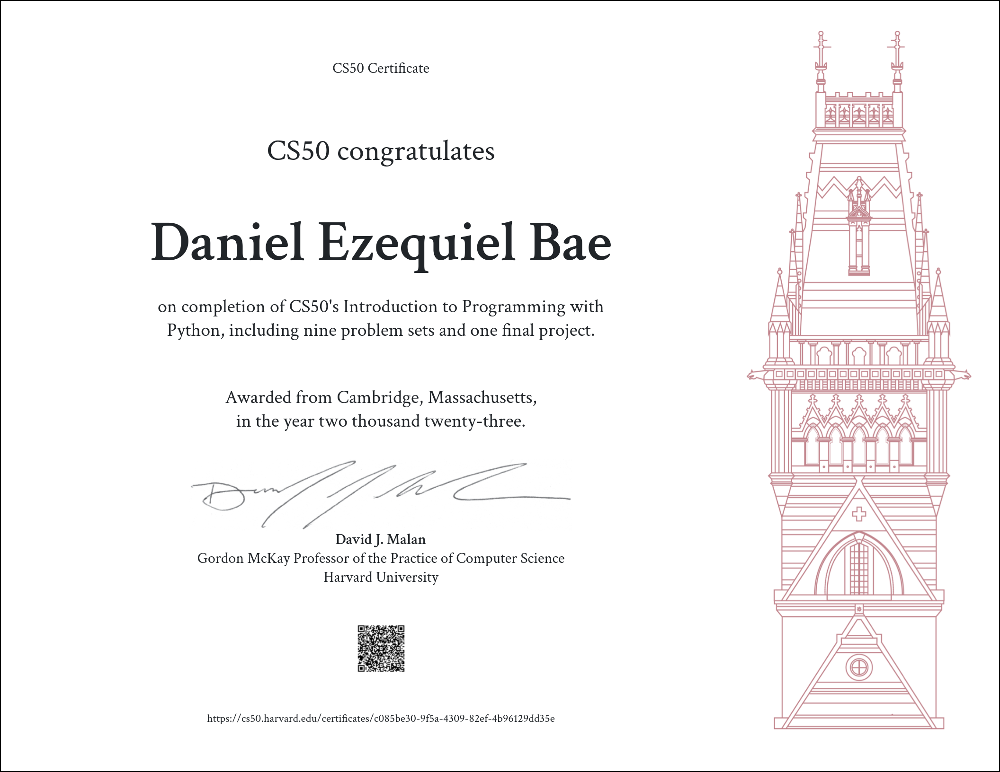

# CS50P Introduction to Programming with Python

I made this repository to document my progress of Harvard University's CS50P course. Materials for the course in 2022 can be found <a href="https://cs50.harvard.edu/python/2022/">here</a>.

As of July 2023 here's my certificate of completion for CS50P. 

<h2><a href="https://cs50.harvard.edu/x/2023/honesty/">Academic Honesty</a></h2>

<h2><a href="https://cs50.me/cs50p">Gradebook</a></h2>

<h2><a href="https://cs50.dev">VSCode for CS50</a></h2>
