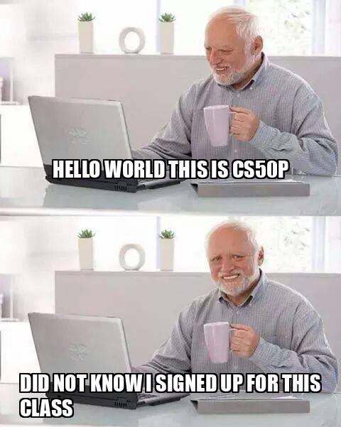

# Memefy


## Video Demo
URL: https://youtu.be/TFl0X-SpktE

## Introduction
Memefy is a project for CS50 Python.

## Description
A lot of folks probably have heard about Hide the Pain Harold, a particular meme in recent history that has literally blown up the Internet. However, not many know the name of the man who has inspired us to create beautiful memes. This project is in honor of András István Arató, know as Hide the Pain Harold.

Memefy takes a stock photo of Hide the Pain Harold and allows users to create a short but descriptive meme. By default the program prompts users for a top text and a bottom text, for which there is a max limit of 40 characters and min threshold of 5 characters. When the user finishes inputting both text fields the image is then saved as ".jpg" format on the filesystem.

## Testing
Unit Tests covered with ```pytest```

```sh
$ pytest test_project.py
```


## Project structure

```sh
project.py
requirements.txt
test_project.py
README.md
```

## Dependencies

- Pillow: The Python Imaging Library adds image processing capabilities to Python

```sh
$ pip install Pillow
```

## Technologies
- Python 3.11.4

## Misc.
- impact.ttf font for Memefy

## GitHub
[@danveb](https://github.com/danveb)

## Sample Memes
<p>Meme 1</p>


<p>Meme 2</p>


<p>Meme 3</p>


<br>
<br>

# Acknowledgements
Thank you to Professor David Malan for helping make Harvard's CS50 available to anyone.

<h3>Happy Learning!</h3>